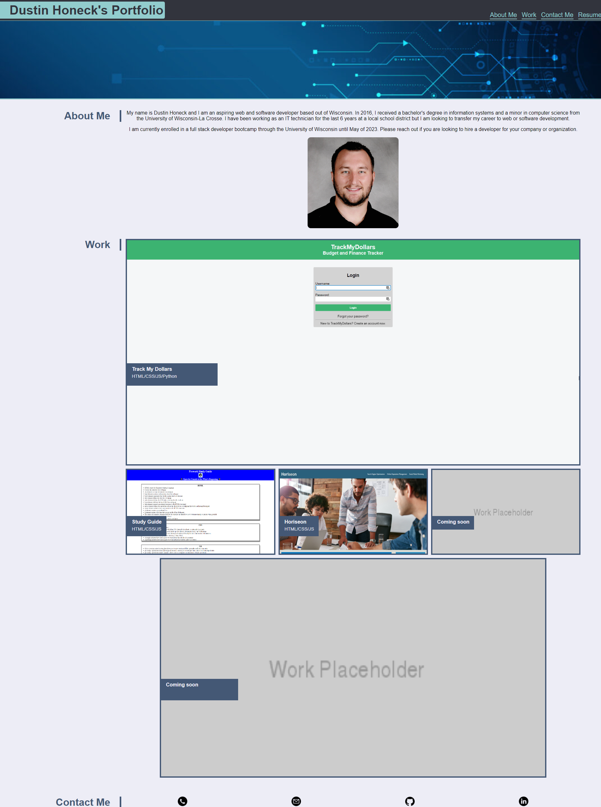

# Dustin Honeck's Portfolio

## Description
This website was made to showcase projects that I have been working on throughout the UW Extension bootcamp as well as other personal projects. I learned that employers like to see past projects and that it can improve your chance of getting an interview if you provide them with a portfolio of work. This portfolio will provide samples of past work, my resume, and contact information for potential employers.

## Website Screenshot

## Published Website

https://dhoneck.github.io/portfolio/

